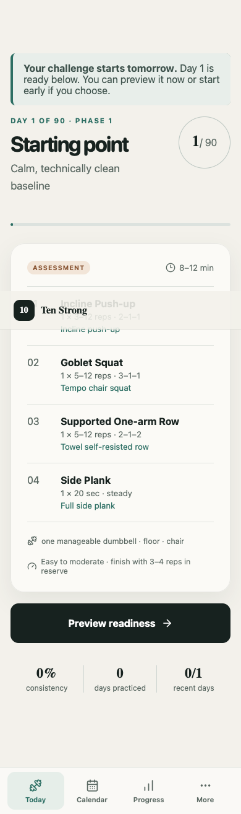
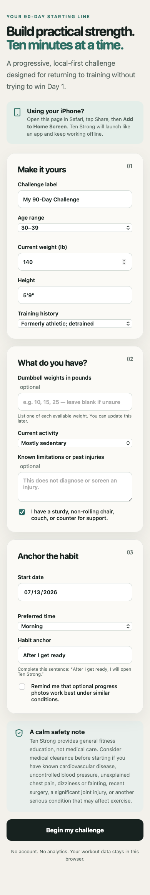
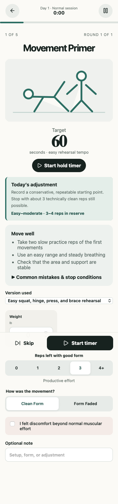

# Ten Strong

**A 90-Day Strength Challenge built around ten intentional minutes per day.**

**Live app:** [https://afinoblakeb.github.io/ten-strong/](https://afinoblakeb.github.io/ten-strong/)

Ten Strong is a finished, mobile-first progressive web app for a detrained adult returning to strength training at home. It combines a complete 90-day program, an ongoing continuation rhythm, structured mobility, a transparent rules-based progression engine, readiness adjustments, local workout logging, and offline support.

No account, backend, analytics, paid API, or remote database is required. Personal data remains in the browser unless the user exports it.



## What is included

- Five-phase, 90-day strength plan with every day defined
- A real ten-active-minute daily contract, with guided mobility filling any unused strength time
- Day 1 baseline and Day 90 comparable final assessment
- Pain-first readiness logic, persisted safety stops, mobility days, and missed-day re-entry guidance
- Daily dumbbell yes/no check with a dedicated travel-ready bodyweight queue
- Three distinct ten-minute mobility sessions and a sustainable Day 91+ continuation week
- Daily habit-anchor reinforcement, weekly cue review, and an optional recurring iPhone calendar cue
- Push, pull, squat, hinge, unilateral leg, trunk, overhead, and carry coverage
- Editable exercise library with cues, common mistakes, regressions, progressions, no-equipment alternatives, and stop conditions
- Transparent progression through load, reps, range, tempo, pauses, leverage, and unilateral work
- Calendar, training-minute chart, consistency, and exercise bests
- Versioned local persistence with Zod validation
- JSON backup/restore, CSV summary, print view, and reset controls
- Installable PWA with an offline app shell and locally bundled content
- Hash routing and relative assets for reliable GitHub Pages hosting
- Unit and browser-level tests on desktop Chromium and mobile WebKit

## Screens

| Onboarding | Today | Active workout |
| --- | --- | --- |
|  |  |  |

## Quick start

Requires Node.js 20 or newer and npm.

```bash
git clone <your-repository-url>
cd ten-strong
npm ci
npm run dev
```

Open the local URL printed by Vite, normally `http://localhost:5173`.

## Commands

```bash
npm run dev            # local development server
npm run typecheck      # TypeScript project check
npm run lint           # static lint checks
npm test               # Vitest unit suite
npm run test:coverage  # unit coverage report
npm run test:e2e       # Playwright mobile + desktop critical flows
npm run test:offline   # production build plus offline app-shell test
npm run build          # typecheck and production PWA build
npm run preview        # serve the production build locally
```

The first E2E run may require browser binaries:

```bash
npx playwright install chromium webkit
```

## Production build

```bash
npm ci
npm test
npm run build
npm run preview
```

The static output is written to `dist/`. `vite.config.ts` uses `base: './'`, bundled local assets, a web manifest, and a generated service worker.

## Deploy to GitHub Pages

1. Push the repository to GitHub.
2. Open **Settings → Pages** in the repository.
3. Under **Build and deployment**, select **GitHub Actions**.
4. Push to `main`, or run the **Deploy Ten Strong to Pages** workflow manually.
5. Open the URL reported by the deploy job. This repository is live at `https://afinoblakeb.github.io/ten-strong/`.

The workflow runs locked dependency installation, typechecking, unit tests, lint, production build, artifact upload, and Pages deployment. Hash routing means routes such as `/#/progress` remain reliable under a repository subpath and after refresh.

## Save it to an iPhone Home Screen

1. Open the deployed site in Safari.
2. Tap **Share**.
3. Choose **Add to Home Screen**.
4. Launch **Ten Strong** from the new icon.

After the first successful load, the bundled program and app shell are available offline. Workout history is stored on that device and browser profile.

## How the program works

The calendar is tied to local dates. Missing a day does not shift the program or add make-up volume.

| Phase | Days | Focus | Typical effort |
| --- | ---: | --- | --- |
| Re-entry & movement quality | 1–14 | Technique, tolerance, habit, baseline | 3–4 reps in reserve |
| Capacity & consistency | 15–35 | Useful repetitions and repeatable progression | 2–3 reps in reserve |
| Strength emphasis | 36–63 | Loading, leverage, and unilateral strength | 1–3 reps in reserve |
| Intensification | 64–84 | Focused hard work without junk volume | 1–2 reps in reserve |
| Taper & final assessment | 85–90 | Reduce fatigue, retest, continue | Easy plus one clean assessment |

Readiness decisions follow a fixed order:

1. Pain beyond normal muscular effort blocks the workout and shows calm stop guidance.
2. Significant soreness or a scheduled mobility day produces a ten-minute mobility session.
3. Low energy or mild soreness removes working volume; easy mobility fills the remainder of the ten active minutes.
4. Otherwise the planned session proceeds normally.

Equipment is confirmed separately every day. Choosing **Yes, I have them** keeps the planned dumbbell queue and its progression. Choosing **No dumbbells** swaps that day to movement-matched bodyweight exercises, reorganizes them into a low-setup circuit, and logs the workout under a separate bodyweight template. The loaded queue is not consumed or advanced, so it is ready when dumbbells return.

Completion requires 600 seconds of active practice—not merely leaving the workout screen open. Timed movements use their actual timer; repetition work estimates active seconds from completed reps and prescribed tempo. If the primary queue finishes early, a guided easy-mobility timer fills the exact remainder. Reading and logging time do not reduce that block. Concerning pain is the safety exception: it stops training and can be logged without penalty or make-up work.

Calendar phases still advance with real dates, but intensity does not advance on dates alone. The app caps the training tier until enough ten-minute, symptom-free, multi-pattern strength practices have actually been completed. After Day 90, **Continue Strong** begins automatically with four strength practices and three mobility days per week while preserving all history and progression.

Progression is equally explicit. When all prescribed work reaches the top of its range with at least two clean repetitions in reserve and no discomfort, the next sensible heavier dumbbell is preferred. If none exists, the app recommends one harder variable: reps, range, pause, tempo, unilateral work, or leverage. Missing the lower target, reaching unexpected failure, or reporting discomfort prevents progression.

## Editing program content

Training content is deliberately separated from React views:

- `src/data/exercises.ts` — exercise definitions, cues, substitutions, and warnings
- `src/data/program.ts` — phases, workout templates, rotation logic, and assessment overrides
- `src/data/methodology.ts` — plain-language methodology and source list
- `src/lib/engine.ts` — readiness, date, progression, consistency, and missed-day rules
- `src/types.ts` — shared typed domain model

Any program edit should keep `src/test/program.test.ts` green. The suite verifies 90 continuous days, phase boundaries, valid template references, exercise coaching metadata, assessment placement, and a valid zero-dumbbell transformation for every template.

## Data privacy, backup, and restore

The app stores a versioned `AppData` object in `localStorage`. It contains the profile, equipment, sessions, set logs, assessments, body-weight entries, and dates. It does not upload data, store progress photos, or include analytics.

Browser storage can be lost if site data is cleared. In **More → Settings & data**:

- **Export JSON backup** creates a complete restorable backup.
- **Import JSON** validates the entire file before atomically replacing current data.
- **Download CSV summary** produces human-readable set history.
- **Print readable summary** uses the browser print dialog.
- **Reset everything** requires explicit confirmation.

Malformed, unsupported, and files over 2 MB are rejected without replacing existing in-memory data.

## Architecture

See [docs/ARCHITECTURE.md](docs/ARCHITECTURE.md) for the data flow, persistence boundary, program generation, PWA design, and tradeoffs.

## Safety and methodology

Ten Strong provides general fitness education, not medical care. It does not diagnose injury or promise a specific strength or muscle gain. The methodology screen includes the evidence translation, assumptions, practical recovery guidance, and primary/authoritative sources.

The core training rationale is anchored in the 2026 ACSM resistance training position stand, systematic reviews of failure versus non-failure training, low- and high-load adaptations, training frequency, protein supplementation, and behavior-change evidence. Detailed links live in `src/data/methodology.ts` and in the app.

## Known limitations

- Ten minutes per day cannot maximize every fitness quality simultaneously.
- Training research usually studies longer sessions; this design extrapolates by distributing a modest weekly dose.
- Reps in reserve and discomfort are self-reported and initially imprecise.
- Large jumps between home dumbbell weights can limit ideal load progression.
- Percentage improvement is meaningful only under matching variation, load, range, and tempo.
- The app cannot diagnose pain, screen every medical condition, or replace professional care.
- Data does not sync between devices; a JSON backup is required to move it.
- Browser/private-mode storage behavior varies, and multiple open tabs use last-write behavior.
- Ten Strong cannot silently schedule iPhone notifications; it can provide an optional recurring Calendar event that the user explicitly approves.

## Future enhancements

- Side-specific logging and comparison for unilateral movements
- Richer comparable-test capture for variation, support height, and range
- Persist the remaining seconds of an in-progress timed hold across full app termination
- Optional encrypted device-to-device sync without an account
- Additional low-load progression ladders and accessibility-tested movement visuals
- A richer archived 90-day milestone report inside the ongoing continuation history

## Contributing and license

See [CONTRIBUTING.md](CONTRIBUTING.md). Ten Strong is available under the [MIT License](LICENSE).
